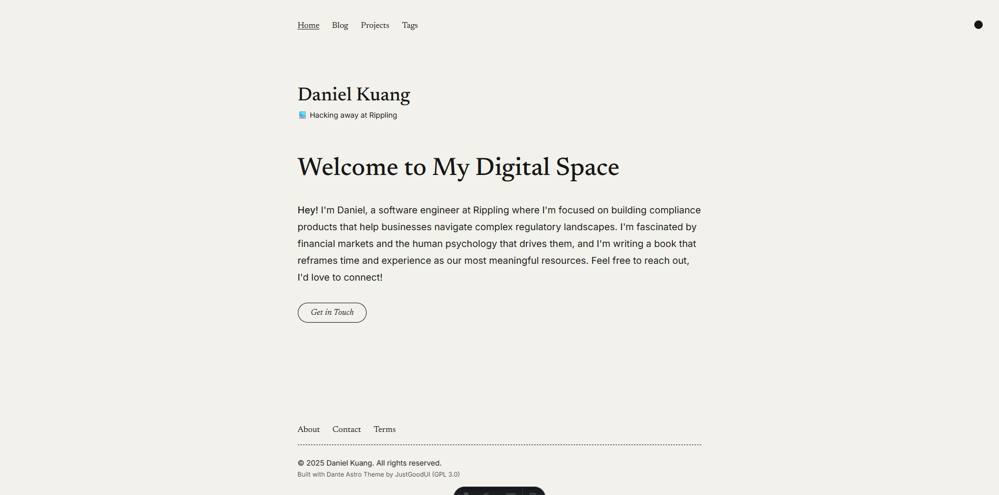

# Daniel Kuang's Studio

My personal website and blog, built with Astro.js and Tailwind CSS. This site showcases my work, thoughts on technology, finance, and human psychology, and serves as a space for sharing my projects and writing.



## About This Site

This website is forked from the [Dante Astro theme](https://github.com/JustGoodUI/dante-astro-theme) by JustGoodUI, customized for my personal use. It features a minimal, responsive design focused on content and readability.

## Technical Details

For detailed information about theme features, integrations, project structure, and development commands, please refer to the [original Dante Astro theme repository](https://github.com/JustGoodUI/dante-astro-theme).

## Development

To get started with development:

```bash
npm install
npm run dev
```

For more Astro.js information, check out the [official documentation](https://docs.astro.build).

## Credits

- **Original Theme**: Built with [Dante Astro Theme](https://github.com/JustGoodUI/dante-astro-theme) by JustGoodUI
- **License**: This project is licensed under [GPL-3.0](https://github.com/JustGoodUI/dante-astro-theme/blob/main/LICENSE) as required by the original theme
- **Demo Images**: Images from [Unsplash](https://unsplash.com/)

## License

This project is licensed under the [GPL-3.0](https://github.com/JustGoodUI/dante-astro-theme/blob/main/LICENSE) license, as required by the original Dante theme.
